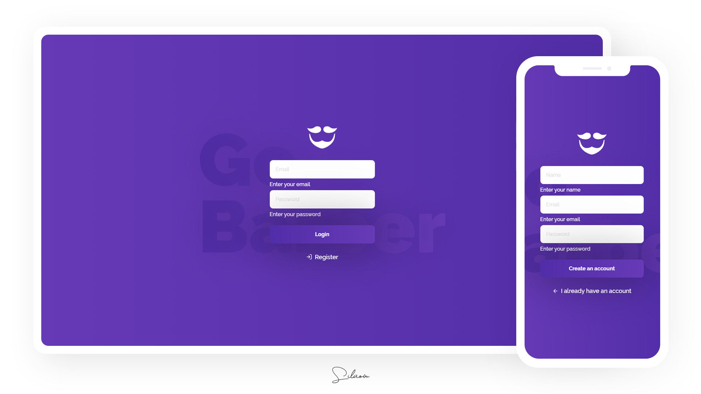
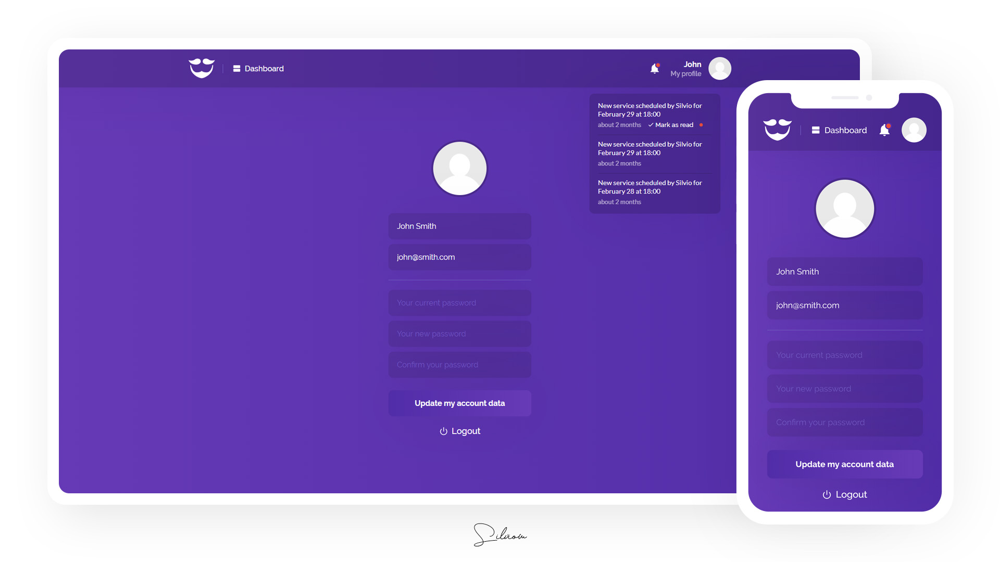
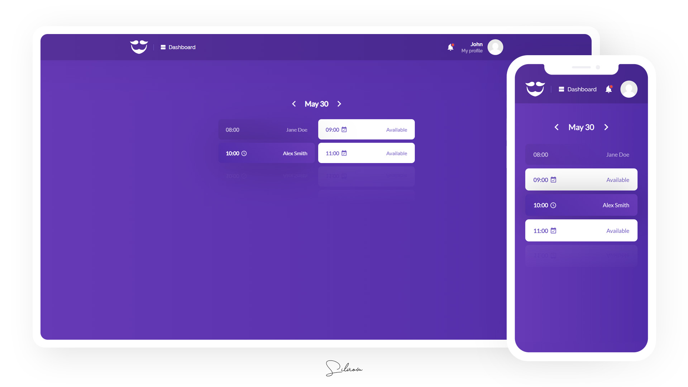

# GoBarber
:date: An app for barber appointment and scheduling.

Discontinued cross-platform application which was being developed for study purposes with Node.js, React.js and React Native during [@Rocketseat](https://github.com/rocketseat)'s GoStack bootcamp.

Check out [the new version of this app](https://github.com/silviow/gobarber-ts) :)

Some technologies and tools used on this project:

- Node.js
- Express
- Nodemailer
- Bee-Queue
- Sequelize
- PostgreSQL
- Mongoose
- MongoDB
- Bcrypt.js
- Sentry
- Multer
- JWT
- ESLint
- Prettier
- React.js
- Redux
- Redux Saga

